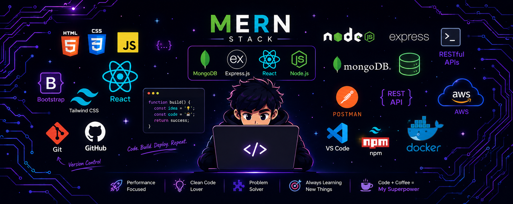

# Hi, I'm Pradyum Meshram 👋

### Full Stack Developer · Backend & Distributed Systems Enthusiast

Building **scalable web applications, backend services, and distributed systems** with a focus on clean architecture, performance, security, and reliability.

Currently working with **MERN, TypeScript, Redis, Supabase, and Docker**, while deepening my knowledge of **System Design, Distributed Systems, and Data Structures & Algorithms**.

 

---

## 👨‍💻 About Me

* 🎓 B.E. Computer Engineering student at **Savitribai Phule Pune University**
* 💻 Aspiring **Full Stack / Backend Engineer**
* ⚙️ Building applications using **MERN + TypeScript**
* 🧠 Exploring **Distributed Systems & System Design**
* 🚦 Working with **Redis, caching, rate limiting and distributed coordination**
* 🔐 Building secure systems with **JWT, bcrypt and role-based authorization**
* 🔌 Exploring **WebSockets and real-time application architecture**
* 🗄️ Working with **MongoDB, MySQL and Supabase**
* 🐳 Learning **Docker and containerized backend systems**
* 🧩 Practicing **Data Structures & Algorithms**
* 🚀 Interested in building **scalable, reliable and production-oriented systems**

---

# 🛠️ Tech Stack

### Languages

### Frontend

### Backend

### Databases & Backend Services

### Infrastructure & Tools

### Engineering Technologies

---

# 🚀 Featured Projects

<table>
<tr>

<td width="50%" valign="top">

<h3>📦 Packet — Distributed CDN</h3>

A distributed Content Delivery Network designed to route requests across edge nodes and serve cached content closer to users.

<b>Engineering Highlights</b>

<ul>
<li>Distributed request routing</li>
<li>Edge-node caching</li>
<li>Content replication</li>
<li>Node health checks</li>
<li>Automatic failover</li>
<li>Fault-tolerant architecture</li>
</ul>

<b>Tech Stack</b>

</td>

<td width="50%" valign="top">

<h3>🚦 Distributed Rate Limiter</h3>

A distributed rate-limiting service that coordinates request limits across multiple application instances using Redis.

<b>Algorithms</b>

<ul>
<li>Fixed Window</li>
<li>Sliding Window</li>
<li>Token Bucket</li>
<li>Leaky Bucket</li>
<li>Distributed request coordination</li>
</ul>

<b>Tech Stack</b>

</td>

</tr>

<tr>

<td width="50%" valign="top">

<h3>🏛️ CivicPulse</h3>

A civic technology platform for reporting, tracking and managing local issues through citizen and administrative workflows.

<b>Core Features</b>

<ul>
<li>Civic issue reporting</li>
<li>Issue tracking</li>
<li>Administrative workflows</li>
<li>User authentication</li>
<li>Role-based access</li>
<li>Centralized issue management</li>
</ul>

<b>Tech Stack</b>

</td>

<td width="50%" valign="top">

<h3>🔎 RecallX</h3>

A full-stack application focused on structured information management and efficient retrieval through a modern web interface.

<b>Core Concepts</b>

<ul>
<li>Full-stack architecture</li>
<li>REST API communication</li>
<li>Structured data management</li>
<li>Search & retrieval</li>
<li>Authentication</li>
</ul>

<b>Tech Stack</b>

</td>

</tr>

<tr>

<td width="50%" valign="top">

<h3>💬 ChatFlow</h3>

A real-time communication application built around persistent messaging, authentication and real-time client-server communication.

<b>Core Features</b>

<ul>
<li>Real-time messaging</li>
<li>WebSocket communication</li>
<li>User authentication</li>
<li>Persistent conversations</li>
<li>Protected routes</li>
</ul>

<b>Tech Stack</b>

</td>

<td width="50%" valign="top">

<h3>🔐 Authentication Service</h3>

A reusable authentication backend providing secure identity and access management for web applications.

<b>Security Features</b>

<ul>
<li>User registration & login</li>
<li>JWT-based authentication</li>
<li>Refresh token authentication</li>
<li>Password hashing with bcrypt</li>
<li>Protected routes</li>
<li>Role-based authorization</li>
<li>Authentication middleware</li>
</ul>

<b>Tech Stack</b>

</td>

</tr>

</table>

---

# 📌 Other Projects

<table>

<tr>

<td width="50%" valign="top">

<h3>🔗 URL Shortener</h3>

A full-stack URL shortening service that generates compact URLs and provides fast redirection.

<b>Tech Stack</b>

</td>

<td width="50%" valign="top">

<h3>🗓️ LeaveFlow</h3>

A leave management system with employee and administrator dashboards, authentication and role-based workflows.

<b>Tech Stack</b>

</td>

</tr>

<tr>

<td width="50%" valign="top">

<h3>⛅ Weather Dashboard</h3>

Responsive weather application consuming a public weather API and displaying weather information through a clean interface.

<b>Tech Stack</b>

</td>

<td width="50%" valign="top">

<h3>🌐 Personal Portfolio</h3>

Responsive developer portfolio showcasing projects, technical skills and development experience.

<b>Tech Stack</b>

</td>

</tr>

</table>

---

# 🧠 Engineering Focus

| Backend Engineering | Distributed Systems |     Security     |    Real-Time Systems   |
| :-----------------: | :-----------------: | :--------------: | :--------------------: |
|      REST APIs      |       Caching       |        JWT       |       WebSockets       |
|      Middleware     |    Rate Limiting    |      bcrypt      |        Socket.IO       |
|   API Architecture  |     Replication     |       RBAC       |    Real-Time Events    |
|   Database Design   |       Failover      |   Authorization  |  Persistent Messaging  |
|   API Integration   |    Health Checks    | Protected Routes | Client Synchronization |

---

# 📚 Currently Learning

 

* **Advanced TypeScript**
* **Backend Architecture**
* **Distributed Systems**
* **System Design**
* **Redis & Distributed Caching**
* **Docker & Containerization**
* **Supabase & PostgreSQL**
* **Database Design**
* **Data Structures & Algorithms**
* **Scalable API Architecture**

---

# 📊 GitHub Statistics

 

---

# 📈 GitHub Activity

---

# 📫 Let's Connect

  

  

### Building systems. Solving problems. Learning continuously.

